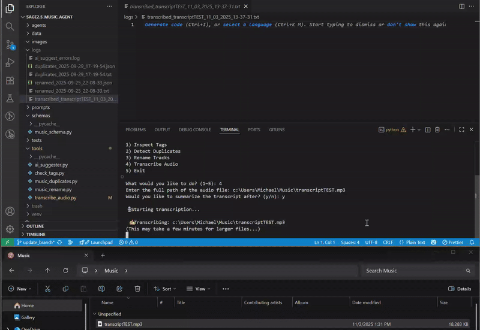

# 🎵 TrackSAGE — DJ Music Tool 

**TrackSAGE** is a local-first **AI-powered music organization tool for DJs** that helps keep your library clean, consistent, and performance-ready. TrackSage can help you:

- ✅ **Inspect Tags** (using Mutagen)  
- ✅ **Detect and remove duplicate MP3s** (using file hashing + smart filename heuristics)  
- ✅ **Rename MP3s** based on their ID3 tags (`Artist - Title`)
- ✅ **Audio Transcription** (using Whisper by Open AI)  
- 📂 **Log all operations** into machine-readable JSON and human-readable TXT for transparency  
- 🛡️ **Safe Trash system** – no files are permanently deleted; duplicates are moved into `trash/` with a timestamp  

This is a personal utility project designed for learning about agents, automation, and structured data while solving a real-world pain point: keeping large music libraries clean.  

---

## ⚙️ Features  

### 1. Inspect Tags  
- Scans `.mp3` and `.wav` files using [`mutagen`](https://mutagen.readthedocs.io/) to extract metadata.  
- Displays `artist`, `title`, `album`, and other available tags in the console.  
- Helps identify missing or inconsistent ID3 metadata before renaming or organizing.  
- Optionally logs all tag data into `logs/inspect_tags_<timestamp>.txt`.  

</br>
</br>
DEMO:


### 2. Duplicate Detector  
- Scans a folder (recursively) for `.mp3` and or `.wav` files.  
- Computes an **MD5 hash** of file contents (so even renamed copies are caught).  
- Uses filename heuristics to decide which file to **keep** (e.g., prefers clean names like `Track.mp3` over `Track - Copy (1).mp3`).  
- Moves duplicates into `trash/<timestamp>/` for review.  
- Logs all results to both JSON and TXT.
  </br>
  </br>
DEMO:


### 3. Renamer  
- Reads ID3 tags (`artist`, `title`) using [`mutagen`](https://mutagen.readthedocs.io/).  
- Renames files into the format:

  - Sanitizes names to remove illegal characters (`<>:"/\|?*`).  
  - Ensures uniqueness (`Song.mp3`, `Song (1).mp3`, etc.).  
  - Has a **Dry Run mode** to preview changes before committing.  
  - Logs renamed/skipped files into JSON and TXT.
  </br>
  </br>
DEMO:


### 4. Audio Transcription  
- Converts speech from `.mp3`, `.wav`, and other supported formats into text using [`Faster-Whisper`](https://github.com/guillaumekln/faster-whisper).  
- Detects language and timestamps automatically for each segment.  
- Saves full transcripts into `logs/transcribed_<timestamp>.txt`.  
- Optionally uses the **OpenAI API** to generate summarized notes of the transcript.  
- Summaries are saved as `logs/ai_summary_<timestamp>.txt`.  
- Designed for lectures, interviews, or long-form course recordings.  

</br>
</br>
DEMO: 


---
# Get Started

1. **Clone the repo**
```
git clone https://github.com/yourusername/sage2.5_music_agent.git
cd sage2.5_music_agent
```
   
2. **Create a virtual environment**
```python -m venv venv
source venv/bin/activate   # Mac/Linux
venv\Scripts\activate      # Windows
```

3. **Install dependencies**
```
pip install -r requirements.txt
```

5. **Run the app**
```
python main.py
```

🖥️ Usage

When you run python main.py, you’ll see a menu:
```
🎵 TrackSAGE - DJ Tool 🎵
Choose a tool:
1) Inspect Tags
2) Detect duplicates
3) Rename tracks
4) Transcribe Audio
5) Exit
```
### 1. Inspect Tags  
- Enter the folder path to scan.  
- Lists all tag information directly in the console or saves to logs.  

---

### 2. Detect Duplicates  
- Enter the path to the folder you want to scan.  
- Duplicates will be moved to `trash/<timestamp>/`.  
- Logs saved under:  
  - `logs/duplicates_<timestamp>.json`  
  - `logs/duplicates_<timestamp>.txt`  

---

### 3. Rename Tracks  
- Enter the folder path to scan for MP3/WAV renames.  
- Choose Dry Run:  
  - `y` → preview changes  
  - `n` → apply changes  
- Renamed files will overwrite their filenames.  
- Logs saved under:  
  - `logs/renamed_<timestamp>.json`  
  - `logs/renamed_<timestamp>.txt`  

---

### 4. Transcribe Audio  
- Provide a single audio file path.  
- Optionally choose to summarize the transcript.  
- Saves:  
  - Transcript → `logs/transcribed_<timestamp>.txt`  
  - Summary → `logs/ai_summary_<timestamp>.txt`  

---
📑 Example Logs
- Checkout Example logs in the logs_example.txt file.
  
---

**This is a personal learning project. Free to use, modify, or extend.**
</br>
👷‍♂️**This project is still under construction.**👷‍♂️
